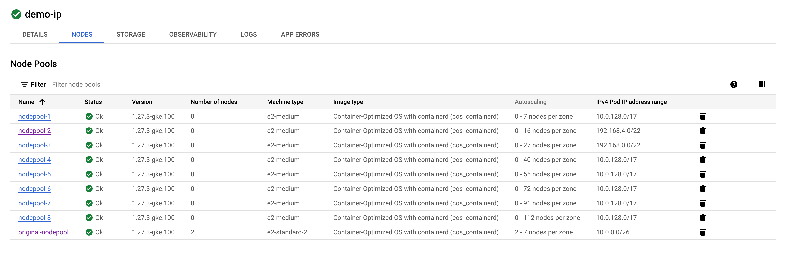
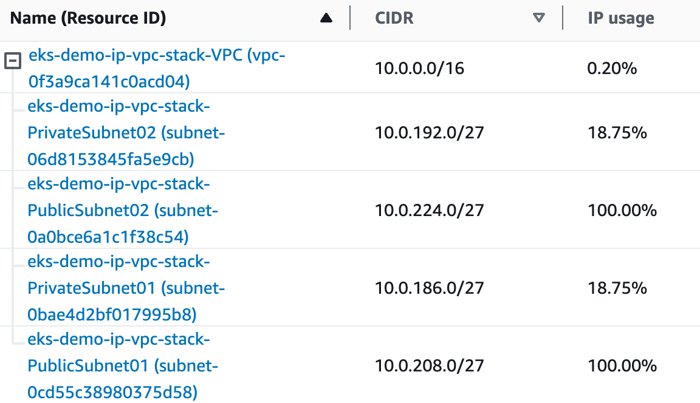
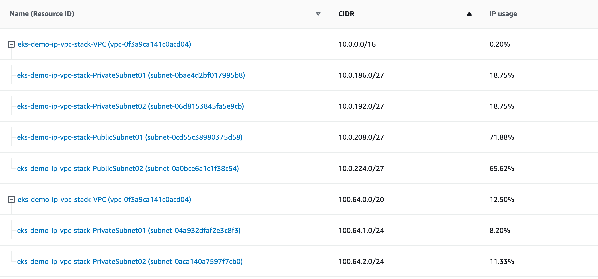

# Welcome

Purpose of this demo is to explore different approaches to k8s IP Address Management (IPAM) by examining Pod IP exhaustion mitigation strategies in GKE and EKS.

Managed Kubernetes distributions rely on the computing and networking primitives of the specific cloud platforms they are built on, often exhibiting substantial variations beyond the fundamental principles. Additionally Kubernetes itself provides hundreds of configuration options which further contributes to discrepancies.

## Source Code

The clusters for this demore were provisioned using source code in this repo:

GKE: [gcp/terraform](https://github.com/olga-mir/k8s/tree/v0.0.3/gcp/terraform)

EKS: [aws/eksctl](https://github.com/olga-mir/k8s/tree/v0.0.3/aws/eksctl)


## Intro

Kubernetes networking model requires that every pod has its own IP and any pod can communicate with any other pod in the cluster. Kubernetes itself doesn't implement this model, nor does it prescribe how to implement it. In early days CNIs implemented an overlay network model (tunnel). Packets traveling between pods on different nodes were encapsulated, incurring bandwidth and processing overhead. In this model pod IPs are opaque to the network and therefore they have no constraints.

With the rise of managed k8s, cloud providers implemented solutions that integrate directly with underlying VPC and pod IPs become directly routable on the VPC, making them first-class citizen. This is often referred to as native VPC, integrated, flat network or even underlay. Because Pod IPs are now visible on the network they become expensive commodity since they must avoid collisions with all other services running in the VPC and connected networks.

When pod IPs are allocated to the nodes is controlled by `--allocate-node-cidrs` flag in `kube-controller-manager`. If it is set then each node is allocated a slice of the Pod IP range at the time when node is created. GKE implements this approach. EKS on the other hand, allocates IPs in a more granular way and not necessarily on the time of node creation.

## Out of Scope

Node IPs, ClusterIP services, IPv6, Cluster rebuild and clustr re-architecture (by e.g. using private NAT Gateways and similar). We will only explore options of adding a new CIDR range to the cluster, assuming that you are able to find available range in your org.

# GKE

<details>
  <summary>Pod IP Exhaustion in GKE</summary>

## Network and Initial Setup

GCP subnet consists of Primary IP range and optionally Secondary IP ranges. In GKE, node's IPs are allocated from Primary range, Pods and Services IPs are allocated from secondary ranges. Each nodepool is allocated a secondary pod range, from which Pod IP ranges are allocated to the nodes in this nodepool.

One secondary range can be allocated to more than one nodepool and each nodepool can have only one secondary range associated with it.

In the basic scenario there is one secondary range on the subnet which is used by the cluster as default pod IP range:

```
% gcloud compute networks subnets describe cluster | yq '{"ipCidrRange": .ipCidrRange, "secondaryIpRanges": .secondaryIpRanges}'
ipCidrRange: 10.1.0.0/16
secondaryIpRanges:
  - ipCidrRange: 10.0.0.0/26
    rangeName: pod-range
  - ipCidrRange: 172.16.0.0/20
    rangeName: svc-range
```

The demo cluster has 1 nodepool. In GKE each nodepool must have a secondary range associated with it and only one range.
```
% gcloud container node-pools describe original-nodepool --cluster demo-ip | yq '{"maxPodsConstraint": .maxPodsConstraint, "networkConfig": .networkConfig, "podIpv4CidrSize": .podIpv4CidrSize}'
maxPodsConstraint:
  maxPodsPerNode: '16'
networkConfig:
  enablePrivateNodes: false
  podIpv4CidrBlock: 10.0.0.0/26
  podRange: pod-range
podIpv4CidrSize: 27
```

16 pods require GKE to reserve twice as many IPs and therefore the pods section of the IP is 5 bits (resulting in /27 podCIDR size as can be seen in this output), this allows only 2 nodes in the cluster.

## Reproduce Pod IP exhaustion

Because pod IP CIDR is allocated per node at the time of node creation, provisioning a node can fail if there is not enough IPs:

```
% k get po
NAME                           READY   STATUS    RESTARTS   AGE
alpine-curl-648f8f669c-t4d4v   1/1     Running   0          85s
alpine-curl-648f8f669c-vmmzl   1/1     Running   0          85s
alpine-curl-648f8f669c-wltzt   0/1     Pending   0          85s

% k describe po alpine-curl-648f8f669c-wltzt | grep -A 15 "Events:"
Events:
  Type     Reason             Age                 From                Message
  ----     ------             ----                ----                -------
  Normal   TriggeredScaleUp   97s                 cluster-autoscaler  pod triggered scale-up: [{https://www.googleapis.com/compute/v1/projects/PROJECT_ID/zones/australia-southeast1-b/instanceGroups/gke-demo-ip-original-nodepool-22330990-grp 2->3 (max: 7)}]
  Warning  FailedScaleUp      53s                 cluster-autoscaler  Node scale up in zones australia-southeast1-b associated with this pod failed: IP space exhausted. Pod is at risk of not being scheduled.
  Warning  FailedScheduling   42s (x2 over 102s)  default-scheduler   0/2 nodes are available: 2 Too many pods. preemption: 0/2 nodes are available: 2 No preemption victims found for incoming pod..
  Normal   NotTriggerScaleUp  42s                 cluster-autoscaler  pod didn't trigger scale-up: 1 in backoff after failed scale-up
```

Note **Node scale up ...  associated with this pod failed: IP space exhausted** Even though it doesn't spell out if it is Node IP or Pod IP exhausted, in this case it is Pod IP - in this demo cluster the Primary range is /16 which is pretty big and it has only 2 nodes. In this case it is indeed failed due to Pod IP exhaustion.

Cluster Autoscaler leaves a little note on the pod for itself:
```
% k get po alpine-curl-648f8f669c-wltzt -o yaml | yq '.metadata.annotations'
cloud.google.com/cluster_autoscaler_unhelpable_since: 2023-11-03T07:07:42+0000
cloud.google.com/cluster_autoscaler_unhelpable_until: Inf
```

## Mitigation

As mentioned earlier we will only explore options of adding a new range to the existing cluster. In GKE this method is called **Discontiguous multi-Pod CIDR** and is described in [2] and there are 3 options how this can be done:

* Create and assign additional secondary ranges to the cluster (new in v1.26)
* Create a node pool with a new secondary Pod IP address range (GKE manages subnet)
* Create a node pool using an existing secondary Pod IP address (you manage subnet)

The first option, adding to the cluster, is in the end of the day still results in nodepools with only one range with only difference with the last option being that assigning ranges to nodepool is done by GKE. This is suitable for clusters with dynamic nodepool provising (NAP) but it is failry useless for clusters with pre-defined static nodepools.

Example:
```
for i in {1..8}; do
  max_nodes=$(( $(( 6 + $i )) * $i ))
  gcloud container node-pools create nodepool-${i} --cluster=$cluster --max-pods-per-node=32 --enable-autoscaling --min-nodes=0 --max-nodes=$max_nodes --spot
  gcloud container clusters resize $cluster --node-pool=nodepool-${i} --num-nodes=0 -q
done
```
Can result in something like this:




</details>


# EKS

<details>
  <summary>Pod IP Exhaustion in EKS</summary>

## Network and Cluster Setup

Looking at the VM with the help of ipamd provided tool:
```
[root@ip-10-0-208-27 ~]# curl -s http://localhost:61679/v1/enis | python -m json.tool | jq .
{
  "AssignedIPs": 4,
  "ENIs": {
    "eni-00259388be69d244d": {
      "AvailableIPv4Cidrs": {
        "10.0.208.24/32": {
          "AddressFamily": "",
          "Cidr": {
            "IP": "10.0.208.24",
            "Mask": "/////w=="
          },
          "IPAddresses": {},
          "IsPrefix": false
        },
        "10.0.208.5/32": {
          "AddressFamily": "",
          "Cidr": {
            "IP": "10.0.208.5",
            "Mask": "/////w=="
          },
          "IPAddresses": {
            "10.0.208.5": {
              "Address": "10.0.208.5",
              "AssignedTime": "2023-11-04T00:33:02.972941607Z",
              "IPAMKey": {
                "containerID": "abeb1b394e1806b060ac75a8f5dd867b484563c510e2a462bec122923a3998a3",
                "ifName": "eth0",
                "networkName": "aws-cni"
              },
              "IPAMMetadata": {
                "k8sPodName": "alpine-curl-648f8f669c-vjrf4",
                "k8sPodNamespace": "test"
              },
              "UnassignedTime": "0001-01-01T00:00:00Z"
            }
          },
          "IsPrefix": false
        },
```

There is a number of ENIs attached to the instance, and each ENI has a number of IPs, some of these are assigned for the pods and some are available for future pods that will be created on the node.

## IPAM AWS Service page




## Mitigation

Again we will mitigate by adding more Pod IPs to the cluster, in AWS this method is called **Custom Networking for Pods** and is described in [3]

Full mitigation script: [aws/eksctl/ip-exhaustion-demo.sh](https://github.com/olga-mir/k8s/blob/main/aws/eksctl/ip-exhaustion-demo.sh)

Note that with `eksctl` there is no need to manually create IAM resources like in the official AWS tutorial

Network after adding new range and subnets:

```
+ aws ec2 describe-subnets --filters Name=vpc-id,Values=$vpc_id --query 'Subnets[*].{SubnetId: SubnetId,AvailabilityZone: AvailabilityZone,CidrBlock: CidrBlock}' --output table
-------------------------------------------------------------------
|                         DescribeSubnets                         |
+------------------+-----------------+----------------------------+
| AvailabilityZone |    CidrBlock    |         SubnetId           |
+------------------+-----------------+----------------------------+
|  ap-southeast-2a |  10.0.208.0/27  |  subnet-0cd55c38980375d58  |
|  ap-southeast-2a |  100.64.1.0/24  |  subnet-04a932dfaf2e3c8f3  |
|  ap-southeast-2a |  10.0.186.0/27  |  subnet-0bae4d2bf017995b8  |
|  ap-southeast-2b |  100.64.2.0/24  |  subnet-0aca140a7597f7cb0  |
|  ap-southeast-2b |  10.0.192.0/27  |  subnet-06d8153845fa5e9cb  |
|  ap-southeast-2b |  10.0.224.0/27  |  subnet-0a0bce6a1c1f38c54  |
+------------------+-----------------+----------------------------+
+ aws ec2 describe-vpcs --vpc-ids $vpc_id --query 'Vpcs[*].CidrBlockAssociationSet[*].{CIDRBlock: CidrBlock, State: CidrBlockState.State}' --out table
---------------------------------
|         DescribeVpcs          |
+----------------+--------------+
|    CIDRBlock   |    State     |
+----------------+--------------+
|  10.0.0.0/16   |  associated  |
|  100.64.0.0/20 |  associated  |
+----------------+--------------+
```


Create a new node pool:

Pods on the same node can share the IP addresses from any range:
```
~ % k get po -o wide | grep ip-10-0-208-27.ap-southeast-2.compute.internal
alpine-curl-648f8f669c-fzsr5   1/1     Running   0          9m11s   100.64.1.61    ip-10-0-208-27.ap-southeast-2.compute.internal   <none>           <none>
alpine-curl-648f8f669c-ggjdk   1/1     Running   0          9m11s   10.0.208.24    ip-10-0-208-27.ap-southeast-2.compute.internal   <none>           <none>
alpine-curl-648f8f669c-jsq5g   1/1     Running   0          9m11s   10.0.208.8     ip-10-0-208-27.ap-southeast-2.compute.internal   <none>           <none>
alpine-curl-648f8f669c-lntw2   1/1     Running   0          9m11s   10.0.208.7     ip-10-0-208-27.ap-southeast-2.compute.internal   <none>           <none>
alpine-curl-648f8f669c-rrc4d   1/1     Running   0          9m11s   10.0.208.28    ip-10-0-208-27.ap-southeast-2.compute.internal   <none>           <none>
alpine-curl-648f8f669c-vjrf4   1/1     Running   0          116m    10.0.208.5     ip-10-0-208-27.ap-southeast-2.compute.internal   <none>           <none>
alpine-curl-648f8f669c-x6mlp   1/1     Running   0          8m50s   100.64.1.12    ip-10-0-208-27.ap-southeast-2.compute.internal   <none>           <none>
```

And this is how it looks on the VM:

```
sh-4.2$ hostname
ip-10-0-208-27.ap-southeast-2.compute.internal
sh-4.2$
sh-4.2$ curl -s http://localhost:61679/v1/enis | python -m json.tool | jq '.ENIs|keys'
[
  "eni-00259388be69d244d",
  "eni-01134cfde03ff387e",
  "eni-07ae7b7cd90520202"
]
sh-4.2$ curl -s http://localhost:61679/v1/enis | python -m json.tool | jq '[.ENIs["eni-00259388be69d244d"].AvailableIPv4Cidrs[] | select (.IPAddresses != {}) | .Cidr.IP]'
[
  "10.0.208.24",
  "10.0.208.5",
  "10.0.208.8"
]
sh-4.2$ curl -s http://localhost:61679/v1/enis | python -m json.tool | jq '[.ENIs["eni-01134cfde03ff387e"].AvailableIPv4Cidrs[] | select (.IPAddresses != {}) | .Cidr.IP]'
[
  "100.64.1.12",
  "100.64.1.61"
]
```

After re-shuflling some pods around, IPAM service page shows that all subnets now have some room:



</details>

# References

1 - [Kubernetes networking model](https://kubernetes.io/docs/concepts/services-networking/)

2 - [Discontiguous multi-Pod CIDR](https://cloud.google.com/kubernetes-engine/docs/how-to/multi-pod-cidr)

3 - [EKS Custom Networking for Pods](https://docs.aws.amazon.com/eks/latest/userguide/cni-custom-network.html)
