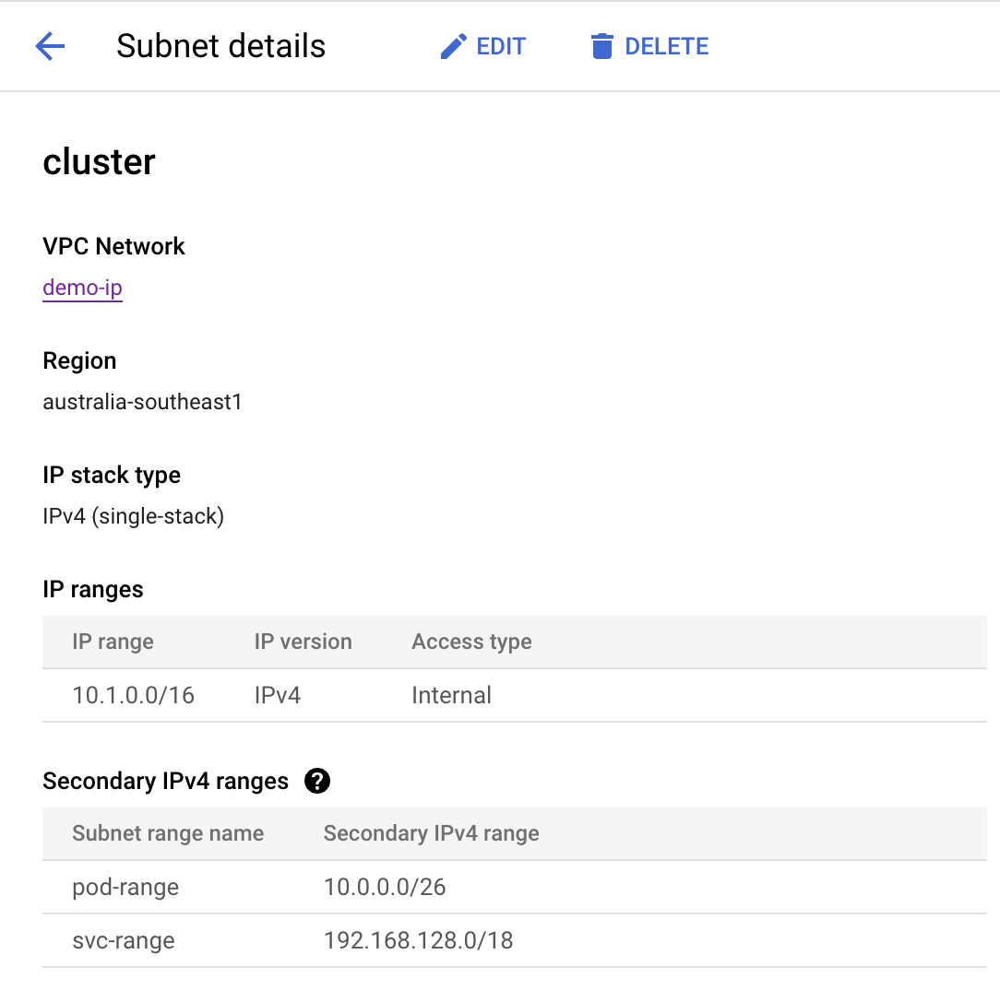

# Welcome

Purpose of this demo is to explore different approaches to k8s IP Address Management (IPAM) by examining Pod IP exhaustion mitigation strategies in GKE and EKS.

Managed Kubernetes distributions rely on the computing and networking primitives of the specific cloud platforms they are built on, often exhibiting substantial variations beyond the fundamental principles.

On top of that k8s itself comes with extensive array of configuration options, one example is `--allocate-node-cidrs` flag for `kube-controller-manger` which impacts when Pod IP(s) are allocated. GKE and EKS choose different approaches and this demo will illustrate its effects, advantages and disadvantages.

The clusters for this demore were provisioned using source code in this repo:

GKE: [gcp/terraform](https://github.com/olga-mir/k8s/tree/v0.0.2/gcp/terraform)

EKS: [aws/eksctl](https://github.com/olga-mir/k8s/tree/v0.0.2/aws/eksctl)

# GKE

  
Pod IP Exhaustion in GKE

# Network

GCP subnet consists of Primary IP range and optionally Secondary IP ranges. In GKE, node's IPs are allocated from Primary range, Pods and Services IPs are allocated from secondary ranges. Each nodepool is allocated a secondary pod range, from which Pod IP ranges are allocated to the nodes in this nodepool.

One secondary range can be allocated to more than one nodepool and each nodepool can have only one secondary range associated with it.

In the basic scenario there is one secondary range on the subnet which is used by the cluster as default pod IP range:

# EKS

  
Pod IP Exhaustion in EKS

  TODO

  https://github.com/olga-mir/k8s/pull/5

